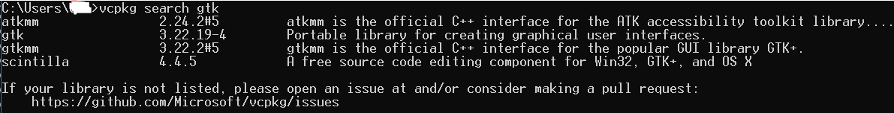
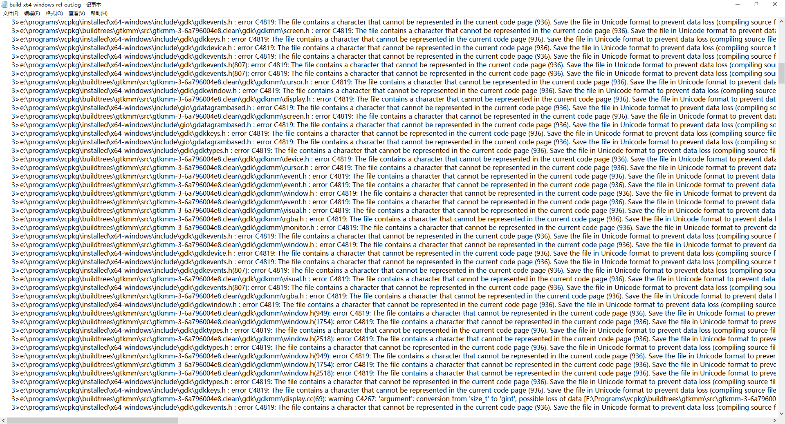

# 安装旧版本Gtk

**示例目标：安装gtkmm 3.22**

# 步骤

1. 回滚到特定的commit

从[这里](https://github.com/microsoft/vcpkg-tool/)下载vcpkg的历史版本，不要执行bat。


2. 安装gtkmm
```bash
vcpkg install gtk
```



3. Done.


# 遇到的问题
## 1. pkg-config


原因是源不提供这个历史版本了。需要从msys官网的库中找到这个包，填入地址和哈希。这个cmake文件的地址可以根据报错的堆栈信息得到。


同样也会遇到这个问题：


一样的，去官网找到这个包，得到地址。哈希官网是256的，我们要的是512，故先不复制过去。


重新编译就可以得到实际的哈希了(Actual Hash)，填入再编译即可。


## 2. atkmm

这次是编译错误：


根据错误提示，找到log文件。


看样子是文件编码问题罗，而且文件是`balancedtree.h`。
找到那个文件，用记事本打开，改用Unicode编码保存即可。
或者可以使用`gtkcodepage.py`，里面有个`LogFileFileName`变量可以设置log文件。它会将log里显示的文件转换为ANSI编码。

## 3. gtkmm

这次也是文件编码问题，但更加恐惧。


太多文件有编码问题啦~



查了很多办法，还是修改区域好用：


之后编译就没问题啦~

# 网络问题

如果连接Github较慢或经常中断，考虑换源。vcpkg似乎没有提供换源的方法，但可以修改其源码实现。比如修改msys源，可对这个文件进行修改。


# 包完整性问题

不知道为何，gtk3没有生成pc文件，意味着pkg-config无法使用。
这就需要自己写pc文件了。脚本中会自动运行`gtkmakepkg.py`，这里面是生成pc文件的代码。目前正在尝试解决中...